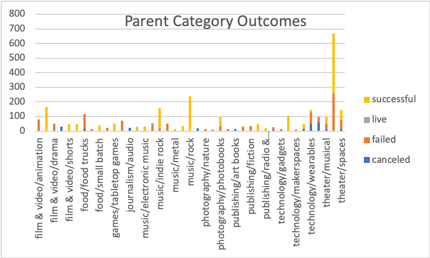
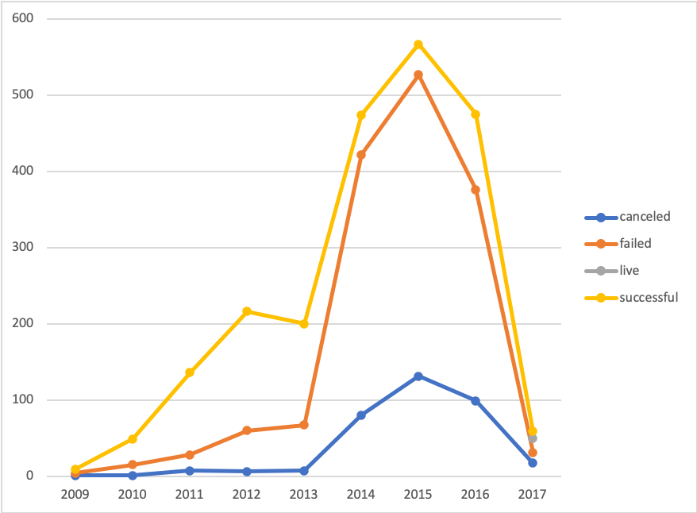

# An Analysis of Kickstarter Campaigns
---
Performing analysis on Kickstarter data to uncover trends
---
##### **Parent Category Outcomes**

---
##### **Outcomes Based on Launch Date**

---
##### Based on the analysis, the most successful campaigns were:
- Theater/Musical
- Music/Rock
- Film & Video/Drama
- Music/Indie Rock
---
##### and the best time of the year to launch a campaign will be in:
- May
- June
